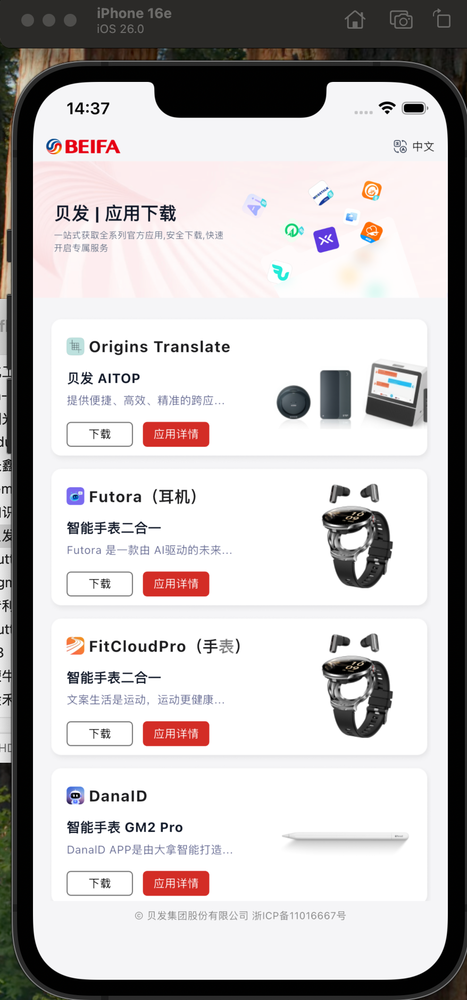
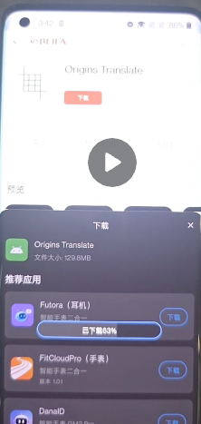

# 贝发集团智能产品APP导航平台

## 项目简介

贝发集团智能产品APP导航平台是一个基于Flutter开发的多平台移动应用，为用户提供贝发集团旗下智能产品的统一展示和下载平台。该应用支持iOS、Android和macOS平台，提供中英文双语支持。

## 主要功能

### 1. 产品展示
- **产品列表**：展示贝发集团旗下5款智能产品应用
- **产品详情**：包含产品截图、应用信息、版本信息、开发者信息等
- **特色横幅**：首页展示推荐产品横幅
- **产品卡片**：美观的产品卡片展示，支持快速下载和查看详情

### 2. 多语言支持
- 支持中文（简体）和英文（美式）
- 语言切换功能，用户可随时切换界面语言
- 语言偏好自动保存，下次启动时自动恢复

### 3. 应用下载
- **Android平台**：支持APK文件下载，显示下载进度，支持安装引导
- **iOS平台**：跳转到App Store进行应用下载
- **下载管理**：自动检测已下载文件，支持直接安装

### 4. 其他功能
- 响应式设计，适配不同屏幕尺寸
- 图片缓存优化，提升加载速度
- 权限管理，确保下载功能正常使用
- 底部版权信息展示

